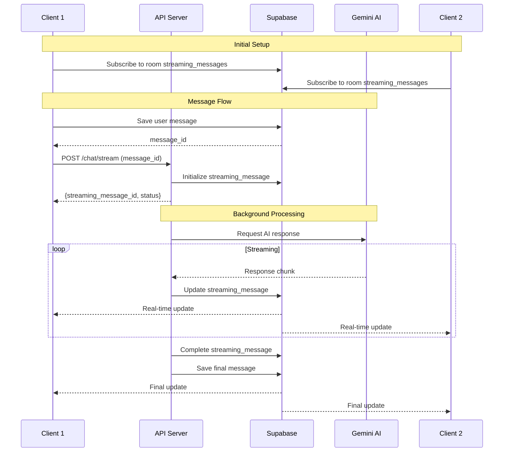

# Streaming Architecture

## Overview

The Panello AI Service uses a background processing architecture with Supabase real-time subscriptions for scalable, multi-client AI chat streaming.

## Architecture Flow



## Database Schema

### Core Tables

```sql
-- AI Configurations
ai
├── id (UUID, PK)
├── name (TEXT)
├── model (TEXT, nullable)
├── system_prompt (TEXT)
└── is_active (BOOLEAN)

-- Permanent Messages
messages
├── id (UUID, PK)
├── room_id (UUID, FK)
├── thread_id (UUID, FK)
├── content (TEXT)
├── sender_type (INTEGER: 1=user, 2=ai)
├── sender_id (UUID)
├── response_to_message (UUID, FK)
└── created_at (TIMESTAMP)

-- Streaming State
streaming_messages
├── id (UUID, PK)
├── room_id (UUID, FK)
├── thread_id (UUID, FK)
├── ai_id (UUID, FK)
├── user_message_id (UUID, FK)
├── content (TEXT)
├── is_complete (BOOLEAN)
├── final_message_id (UUID, FK)
└── updated_at (TIMESTAMP)
```

### Database Functions

```sql
-- Initialize or update streaming message
upsert_streaming_message(
  p_room_id, p_thread_id, p_ai_id, 
  p_user_message_id, p_content, p_is_complete
) RETURNS UUID

-- Complete streaming and create final message
complete_streaming_message(p_streaming_id) RETURNS UUID

-- Cleanup old completed streams
cleanup_old_streaming_messages(p_hours_old) RETURNS INTEGER
```

## Service Layer

### ChatOrchestrator Methods

```python
# Initialize streaming
initialize_streaming_message(room_id, thread_id, ai_id, user_message_id) -> str

# Process in background
async process_streaming_response(room_id, thread_id, ai_id, user_message_id, streaming_message_id)

# Cleanup incomplete streams
cleanup_incomplete_streaming_messages(room_id, thread_id)

# Extract AI name from moderator response (for moderator flow)
_extract_ai_name_from_moderator_response(response: str) -> Optional[str]

# Get AI ID by name from room's available AIs (for moderator flow)
_get_ai_id_by_name(ai_name: str, room_id: str) -> Optional[str]
```

### Moderator Flow

The system includes a special moderator AI (ID: `10000000-0000-0000-0000-000000000007`) that can automatically forward users to appropriate AI mentors:

1. **Detection**: When `ai_id == MODERATOR_AI_ID`, the system builds an enhanced prompt with all available AIs in the room
2. **Response Format**: The moderator uses a specific format:
   ```
   Forward to AI mentor: **{AI name}**.
   Reason is {reason why you choose them in max 100 words}
   ```
3. **Auto-Trigger**: After moderator completes streaming:
   - Extract AI name using regex pattern `**{AI name}**`
   - Look up AI ID by name (case-insensitive)
   - Automatically trigger new stream to selected AI
   - Use same `user_message_id` for continuity
4. **Real-time Updates**: Both moderator and selected AI responses update via `streaming_messages` table

## Multi-Client Synchronization

### Room-Level Subscription Pattern

All clients subscribe to room/thread changes, not specific message IDs:

```javascript
// Every client subscribes when joining
supabase.channel(`room-${roomId}-thread-${threadId}`)
  .on('postgres_changes', {
    event: '*',  // INSERT, UPDATE, DELETE
    schema: 'public',
    table: 'streaming_messages',
    filter: `room_id=eq.${roomId},thread_id=eq.${threadId}`
  }, (payload) => {
    switch (payload.eventType) {
      case 'INSERT':
        // New streaming started by someone
        onStreamingStarted(payload.new);
        break;
      case 'UPDATE':
        // Content updated
        onStreamingUpdate(payload.new);
        break;
      case 'DELETE':
        // Cleanup
        onStreamingDeleted(payload.old);
        break;
    }
  })
  .subscribe();
```

This pattern ensures:
- All clients see updates regardless of who initiated the chat
- No need to share streaming_message_id between clients
- Automatic discovery of new AI responses
- True real-time collaboration

## Performance Optimizations

### Database Indexes

```sql
-- Room + thread lookup
CREATE INDEX idx_streaming_room_thread_active 
ON streaming_messages(room_id, thread_id, is_complete) 
WHERE is_complete = FALSE;

-- User message lookup
CREATE INDEX idx_streaming_user_msg 
ON streaming_messages(user_message_id);

-- Active streams
CREATE INDEX idx_streaming_active 
ON streaming_messages(is_complete) 
WHERE is_complete = FALSE;
```

### Batched Updates

Updates are batched for efficiency:
- Accumulate ~50 characters before updating
- Reduces database writes
- Smoother client experience

### Connection Pooling

- Database connections are pooled
- Async operations throughout
- Non-blocking I/O

## Error Handling

### Graceful Degradation

```python
try:
    # Process streaming
    async for chunk in ai_stream:
        update_streaming_message(chunk)
except Exception as e:
    # Mark as complete with error
    complete_with_error(streaming_id, str(e))
finally:
    # Always cleanup
    cleanup_resources()
```

### Client Reconnection

```javascript
const channel = supabase.channel('room')
  .on('postgres_changes', config, handler)
  .subscribe((status) => {
    if (status === 'SUBSCRIBED') {
      console.log('Connected');
    } else if (status === 'CHANNEL_ERROR') {
      console.error('Connection failed');
      setTimeout(reconnect, 5000);
    }
  });
```

## Scalability

### Horizontal Scaling

The service is stateless and can be scaled horizontally:

```
    Load Balancer
         │
    ┌────┴────┬────────┐
    ▼         ▼        ▼
Service 1  Service 2  Service N
    │         │        │
    └─────────┴────────┘
              │
         Supabase
```

### Cleanup Strategy

Periodic cleanup prevents table bloat:

```sql
-- Run daily
SELECT cleanup_old_streaming_messages(24);
```

## Security Considerations

1. **Row Level Security (RLS)**: Applied on all tables
2. **Input Validation**: Pydantic models validate all inputs
3. **Environment Variables**: Sensitive data in .env
4. **Rate Limiting**: Should be implemented in production
5. **Authentication**: Supabase auth integration recommended